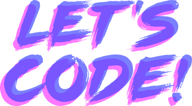

## Introduction

Let's Code is an elegant Express.js application designed as a starting point for showcasing your programming livestreams. To get started, clone this repository and run `npm run start` to begin.

## License

Let's Code is open-source software licensed under the [MIT license](https://opensource.org/licenses/MIT).
